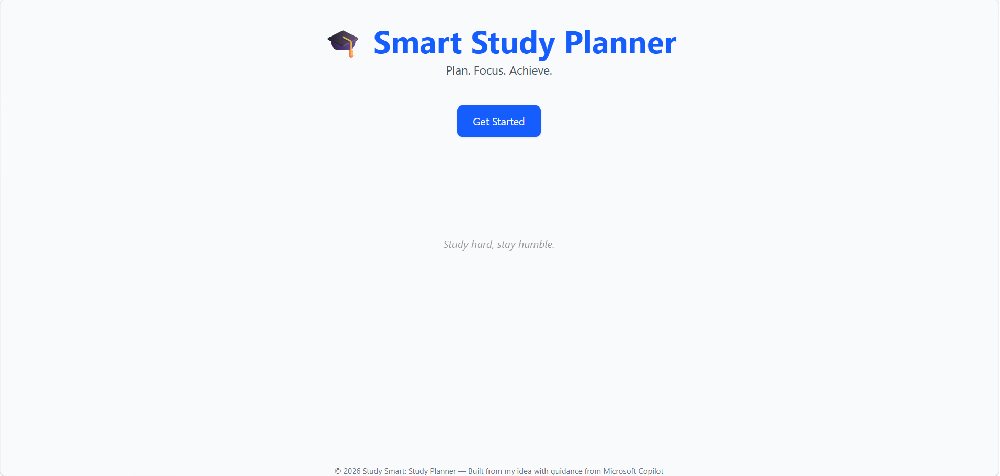
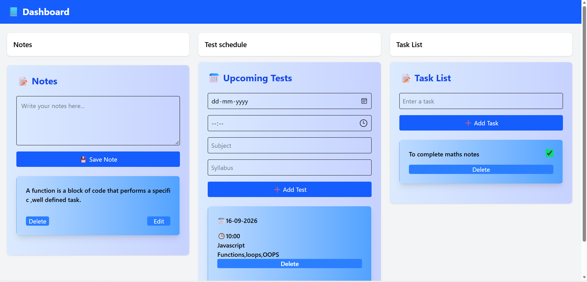

# 📚 Smart Study Planner
### Plan. Focus. Achieve.

A simple web app that helps students organize their study schedule and stay consistent.

## ✨ Introduction
Studying effectively isn’t just about hard work — it’s about smart planning. Many students struggle with managing time, balancing subjects, and staying consistent. That’s where **Smart Study Planner** comes in.  

This web app is designed to simplify your study routine by giving you a clear structure and easy‑to‑use tools. With a clean interface and intuitive features, it helps you:  
- Break down big goals into manageable tasks  
- Build consistency through daily planning  
- Reduce stress by knowing exactly what to focus on  

Whether you’re preparing for exams, revising multiple subjects, or just trying to stay organized, this planner is built to make studying feel less overwhelming and more achievable.

## 🖼️Project screenshot

### Front Page

### Dashboard Page

## 🎥Project Demo Video
<video src="./assets/Videoproject.mp4" control width=100%></video>

## 🛠️ User Instructions
1. **Open the Website**  
   Launch the planner in your browser.

2. **Create Your Schedule**  
   Add notes, topics, or tasks.

3. **Track Progress**  
   Mark tasks as complete and see your progress grow.

4. **Stay Consistent**  
   Use the planner daily to build strong study habits.

## 📌 Acknowledgments
This project was my own idea,developed with helpful guidance and support from Microsoft Copilot.
